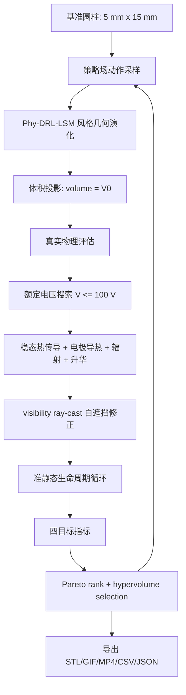

# 钨棒器件全三维生命周期感知拓扑优化技术报告

## 1. 摘要

本项目研究对象是一个由纯钨材料构成、两端接触铜电极的微型高温辐射器件。题目规定横向电极间距始终为 15 mm，初始材料体积等于直径 5 mm、高度 15 mm 的圆柱体体积，但圆柱体本身只作为基准体积和寿命参考，并不是默认最优形状。

我们将问题建模为一个全三维闭合网格拓扑优化问题：在体积严格守恒、电极间距固定、5 mm 圆形电极位置固定、额定电压不超过 100 V、最高温度不超过 3000 degC、寿命不低于基准圆柱寿命 30% 的约束下，搜索一个更优的未蒸发初始形状，使其在额定工况下具备更高的 0-3 um 净出射辐射性能、更长寿命和更好的生命周期平均输出。

当前实现采用 **Lifecycle-Aware Phy-DRL-LSM + MO-CMA-ES** 框架：

- 几何由全三维闭合网格表示，侧壁和上下端面足迹均可变化。
- 动作空间不是逐体素增删材料，而是 Chebyshev/Fourier 低维策略场，驱动类似 level-set 的法向速度演化。
- 每次几何变形后使用体积投影保证材料体积等于基准圆柱体积。
- 对每个候选几何执行真实物理评估：额定电压搜索、稳态热传导、电极导热、表面辐射、表面升华、自遮挡 ray-cast visibility、准静态生命周期循环。
- 多目标选择使用 Pareto 非支配排序和 hypervolume contribution，保留 `P0`、寿命、生命周期平均功率、visibility 之间的折中前沿。

长跑完成于 2026-05-04，共评估 1441 个候选，其中 1437 个满足约束。默认导出的折中候选 `archive_index=61` 达到：

| 指标 | 基准圆柱 | 默认导出折中候选 | 相对变化 |
|---|---:|---:|---:|
| 初始 0-3 um 净出射功率 `P0` | 1.6828 W | 1.8351 W | +9.05% |
| 生命周期平均 0-3 um 净出射功率 | 1.5871 W | 1.8124 W | +14.19% |
| 0-3 um 能量转换效率 | 0.001940 | 0.004198 | 2.16x |
| 寿命比 | 1.0 | 18984.4 | 大幅提升 |
| 最高温度 | 1235.7 K | 1104.3 K | 降低 |
| 额定电压 | 0.34 V | 0.30 V | 均远低于 100 V 上限 |

Pareto archive 中还包含更偏输出功率或效率的候选：

- `archive_index=234`：最高 `P0` 和最高生命周期平均功率，`P0=2.2229 W`，`Pavg=2.2124 W`。
- `archive_index=335`：最高能量转换效率，效率比 `3.195x`，`P0=2.2180 W`，visibility `0.9369`。

默认 STL 当前导出的是 Pareto compromise，而不是最高功率/最高效率候选。展示时需要明确这一点。

## 2. 问题理解

### 2.1 设计对象

设计对象是一个钨制三维实体。基准形状是：

- 材料：纯钨。
- 基准几何：直径 5 mm、高度 15 mm 圆柱。
- 基准体积：

```text
V0 = pi * (2.5 mm)^2 * 15 mm
```

优化对象不是“圆柱上的局部纹理”，而是同体积条件下的全局三维初始形状。换句话说，圆柱仅是体积、寿命和性能参考基准，不是被假定为能量转换效率最高的初始形状。

### 2.2 电极与端面约束

题目要求横向长度，也就是两电极之间的距离，始终为 15 mm。两端铜电极是固定的 5 mm 圆形电极盘，但钨材料的端面足迹可以变化，因此需要区分以下情况：

1. 钨端面超出圆形电极的区域：该端面区域不向外辐射、不升华，也不与电极导热。
2. 原本电极盘内但当前没有钨接触的区域：该区域减少电极导热接触面积，并改变钨棒内部温度分布。

当前模型中：

- 电极圆盘直径固定为 5 mm。
- 钨端面足迹可小于、等于或大于电极圆盘。
- 只有钨端面与电极圆盘的重叠区域参与 300 K 电极导热。
- 所有端面区域均不参与自由表面辐射和升华。
- 自由表面主要指侧壁表面，承担辐射、升华和 visibility 计算。

### 2.3 电学边界条件

额定电压施加在钨两端的电极接触足迹之间，而不是施加在包含电极压降的整个外部电路上。因此：

- 钨两端电压差为求解中的 `tungsten_voltage_v`。
- 电极电压降设为 0。
- 接触电阻忽略。
- 外部串联电阻忽略。
- 100 V 是系统允许的额定电压上限，而不是优化目标电压。

在当前长跑结果中，最优候选的额定电压仍约为 0.30 V，符合用户先前判断：该体积尺度下很难出现接近 100 V 的最佳额定电压。

### 2.4 热学边界条件

热学模型必须包含：

- 钨棒内部轴向热传导。
- 钨与电极接触区域的导热。
- 自由表面对 300 K 环境的辐射散热。
- 自由表面的升华/蒸发导致的质量损失和寿命衰减。

当前边界条件为：

- 电极接触区：300 K 固定温度导热边界。
- 自由侧表面：对 300 K 环境辐射散热，并产生升华质量损失。
- 光学输出目标：统计可逃逸到包围外接球的 0-3 um 波段净辐射功率，外接球按 0 K 吸收目标处理。
- 端面：不辐射、不升华；只有与电极重叠部分参与导热。

## 3. 优化目标与约束

### 3.1 多目标优化目标

SOTA 模式将优化目标定义为四个方向：

```text
maximize [
  P0_escape_0_3um_w,
  lifetime_s,
  lifecycle_avg_escape_0_3um_w,
  escape_visibility_factor
]
```

其中：

- `P0_escape_0_3um_w`：初始未蒸发几何在额定工况下，能够逃逸到外接球的 0-3 um 净辐射功率。
- `lifetime_s`：按特征尺度变化达到 20% 失效准则估算的寿命。
- `lifecycle_avg_escape_0_3um_w`：从初始到失效或时间上限内的平均 0-3 um 净出射功率。
- `escape_visibility_factor`：考虑结构自遮挡后的出射比例。

### 3.2 约束条件

| 约束 | 当前实现 |
|---|---|
| 体积守恒 | 每次几何生成后投影到基准圆柱体积 |
| 电极间距 | 固定 15 mm |
| 电极圆盘 | 两端 5 mm 圆形电极固定 |
| 电压 | 额定电压搜索，`V <= 100 V` |
| 温度 | `Tmax <= 3273.15 K`，即 3000 degC |
| 寿命 | `lifetime >= 0.3 * baseline_lifetime` |
| 端面物理 | 端面不辐射、不升华；重叠区导热 |
| 网格 | 闭合、可导出 STL |

### 3.3 失效准则

题目要求特征尺度 `L1, ..., LN` 中任一尺度相对变化达到 20% 时认为失效：

```text
abs(L_i(t) - L_i(0)) / L_i(0) >= 0.20
```

当前实现使用 SDF/几何诊断风格的特征尺度，包括：

- 局部最小厚度。
- 轴向等效直径。
- 端面接触等效直径。
- 最小 neck 尺度。

生命周期循环中每一步更新升华 recession 后重新计算这些尺度。若任一尺度超过阈值，则生命周期终止。

## 4. 模型与算法架构

### 4.1 总体工作流



### 4.2 几何表示

当前几何是 full 3D closed mesh，而不是轴对称 1D 半径曲线。主要离散参数：

| 参数 | 长跑设置 |
|---|---:|
| 周向段数 `num_segments` | 96 |
| 轴向环数 `num_rings` | 48 |
| 端面 cap rings | 8 |
| 网格类型 | 闭合三角网格 |
| 输出格式 | STL，GIF，MP4，CSV，JSON |

网格包含：

- 侧壁网格：描述自由辐射/升华表面。
- 上下端面网格：描述可变端面足迹。
- 电极接触索引：用于计算端面与 5 mm 电极盘重叠面积。

### 4.3 动作空间

动作空间维度为 `196`。动作不是直接逐体素决定材料增删，而是定义低维连续策略场。

当前动作空间：

- 侧壁：`Chebyshev(z) x Fourier(theta)` 系数。
- 端面：`Chebyshev(radius) x Fourier(theta)` 系数。
- 策略通道数：4。
- 全局形状演化步数：4。

策略通道可理解为对不同物理敏度的加权：

- 辐射增强倾向。
- 寿命/抗升华倾向。
- 电流/焦耳热调控倾向。
- 直接形状扰动倾向。

几何更新可抽象为：

```text
V_raw(x) = alpha_rad(x) * S_rad(x)
         - alpha_evap(x) * S_evap(x)
         + alpha_cur(x) * S_cur(x)
         + alpha_direct(x) * S_direct(x)
```

随后通过体积投影：

```text
V_final(x) = V_raw(x) - lambda
```

使表面法向运动后的总体积保持为基准体积。

### 4.4 热传导模型

热模型采用轴向 lumped ring 离散。每个轴向环有一个温度自由度，考虑以下项：

- 邻近轴向环之间的导热。
- 焦耳热输入。
- 自由表面辐射散热。
- 自由表面升华潜热损失。
- 电极接触区到 300 K 电极的导热。

电阻由温度相关电阻率和截面积积分估算：

```text
R = integral rho_e(T, z) / A(z) dz
I = V / R
P_elec = V * I
```

热平衡可概括为：

```text
conduction + joule_heat - radiation_loss - evaporation_loss - electrode_conduction = 0
```

优化后的性能路径中，线性化稳态热方程形成三对角系统，使用 Thomas 三对角求解器替代 dense `np.linalg.solve`，减少热迭代开销。

### 4.5 额定电压搜索

每个候选几何冻结后，对电压执行一维额定工况搜索：

```text
min_voltage <= V <= 100 V
```

搜索不是为了靠近 100 V，而是寻找该几何下在约束内最优的工况。当前长跑中最优候选的额定电压均为 0.30 V 左右。

搜索配置：

| 参数 | 设置 |
|---|---:|
| `max_voltage` | 100 V |
| `voltage_grid_points` | 11 |
| `voltage_refine_levels` | 2 |
| `voltage_refine_points` | 7 |
| 种子电压 | 0.25, 0.30, 0.34, 0.40, 0.50 V |
| 过热剪枝 | 开启 |

长跑 summary 中：

- `voltage_search_evaluations = 20`
- `voltage_search_pruned = True`

### 4.6 自遮挡 visibility

自由表面辐射不能简单按面积积分，因为几何可能自遮挡。当前模型对自由表面 patch 做半球 ray-cast：

- 每个采样 patch 半球方向采样 `512` 条射线。
- 若射线与自身三角面相交，则视作被结构遮挡。
- 未被遮挡的方向比例形成 `escape_visibility_factor`。
- 0-3 um 输出只积分可逃逸部分。

RTX4090 长跑的 visibility 诊断中 `device=cuda`，说明该部分实际走了 GPU。

### 4.7 生命周期循环

生命周期使用 quasi-static loop：

1. 当前几何下搜索额定电压。
2. 求稳态温度场。
3. 根据温度计算升华质量通量。
4. 将自由表面按 recession rate 更新。
5. 重新计算特征尺度。
6. 若任意特征尺度变化达到 20%，判定失效。
7. 否则继续下一步。

长跑配置中生命周期步数为 `16`。默认导出折中候选在 16 步内没有达到特征失效阈值，`feature_failure_reason = not_failed_within_horizon`。

## 5. 优化器与训练/运行策略

### 5.1 当前主优化器：MO-CMA-ES

当前长跑使用：

```text
optimizer = mo-cmaes
objective_mode = sota
```

MO-CMA-ES 的作用：

- 在 196 维连续动作空间中全局探索几何策略。
- 每代采样 population 个候选。
- 对所有候选做真实物理评估。
- 使用 Pareto 非支配排序和 hypervolume contribution 选择精英。
- 更新均值、协方差和步长。

该方法相比单目标 CEM 的优势是：不会把所有设计压缩成一个固定加权分数，而是保留高功率、高寿命、高 visibility、高效率之间的 Pareto trade-off。

### 5.2 神经策略与 surrogate 的当前状态

代码中包含：

- `train_surrogate.py`
- `train_policy.py`
- lightweight 3D U-Net/GNN policy scaffold

但本次 RTX4090 长跑中：

```text
surrogate_enabled = false
policy_train_metrics.enabled = false
surrogate_train_metrics.enabled = false
```

因此，当前展示应表述为：

> 已完成的是 MO-CMA-ES 驱动的真实物理生命周期拓扑优化长跑；surrogate 和 policy 训练入口已经预留，但本次最终候选不是 surrogate-only 结果，也不是已训练 SAC actor 直接生成的结果。

这是一个更严谨的表述，也符合“最终候选必须由真实物理 evaluator 复评”的要求。

## 6. 训练/运行参数

### 6.1 硬件环境

| 项 | 设置 |
|---|---|
| GPU | NVIDIA GeForce RTX 4090 |
| 运行设备 | `cuda:0` |
| visibility device | `auto`，实际诊断为 `cuda` |
| eval workers | 2 |
| torch CPU threads | 8 |
| 总耗时 | 约 14h10m |

### 6.2 长跑命令

```bash
mkdir -p logs
python -u optimize_3d.py \
  --experiment-name mcga_sota_mocma_4090_long \
  --output-dir outputs/three_d_runs \
  --device cuda:0 \
  --optimizer mo-cmaes \
  --objective-mode sota \
  --generations 30 \
  --population-size 48 \
  --thermal-iters 800 \
  --lifecycle-steps 16 \
  --visibility-rays 512 \
  --visibility-batch-size 512 \
  --visibility-device auto \
  --eval-workers 2 \
  --torch-threads 8 \
  --no-step \
  2>&1 | tee -a logs/sota_mocma_long_$(date +%F_%H%M%S).log
```

### 6.3 关键运行参数

| 参数 | 值 |
|---|---:|
| generations | 30 |
| population size | 48 |
| candidate count | 1441 |
| feasible candidates | 1437 |
| Pareto rank 0 candidates | 217 |
| thermal iterations | 800 |
| lifecycle steps | 16 |
| visibility rays | 512 |
| visibility batch size | 512 |
| action dimension | 196 |
| strategy channels | 4 |
| global shape steps | 4 |
| rated voltage upper bound | 100 V |

### 6.4 产物文件

重要产物：

| 文件 | 说明 |
|---|---|
| `optimized_full3d.stl` | 默认导出的 Pareto compromise 几何 |
| `topology_evolution_full3d.gif` | 拓扑演化动画 |
| `topology_evolution_full3d.mp4` | 拓扑演化视频 |
| `run_summary_full3d.json` | 主 summary |
| `pareto_archive_full3d.csv/json` | 全候选 Pareto archive |
| `lifecycle_trace_full3d.csv` | 最终导出候选生命周期轨迹 |
| `visibility_diagnostics_full3d.csv` | visibility ray-cast 诊断 |
| `design_strategy_report_full3d.md` | 自动生成的简版报告 |

如渲染器支持 GIF，可直接展示：


## 7. 结果

### 7.1 长跑完整性

日志显示：

```text
[3d] gen 30/30 done ... archive=1441, feasible=1437 ... total_elapsed=14h10m
```

未发现：

- Python Traceback。
- RuntimeError。
- CUDA OOM。
- 热求解整体失败。

### 7.2 默认导出折中候选

默认导出候选：

```text
archive_index = 61
selection = Pareto compromise
```

| 指标 | 数值 |
|---|---:|
| `P0_escape_0_3um_w` | 1.835054 W |
| `lifecycle_avg_escape_0_3um_w` | 1.812383 W |
| `energy_conversion_efficiency_0_3um` | 0.00419793 |
| `energy_conversion_efficiency_ratio` | 2.16346 |
| `lifetime_ratio_3d` | 18984.43 |
| `escape_visibility_factor` | 0.88747 |
| `max_temperature_k` | 1104.31 K |
| `voltage_v` | 0.30 V |
| `surface_area_ratio` | 1.23513 |
| `effective_radiating_area_m2` | 1.9869e-4 |
| `electrode_contact_area_m2` | 9.1031e-6 |
| `volume_change_ratio_3d` | 0 |
| `thermal_converged` | True |
| `constraint_feasible_3d` | True |

### 7.3 与基准圆柱对比

| 指标 | 基准圆柱 | 默认导出折中候选 | 说明 |
|---|---:|---:|---|
| 额定电压 | 0.34 V | 0.30 V | 均远低于 100 V 上限 |
| `P0` | 1.6828 W | 1.8351 W | 初始输出提升 |
| 生命周期平均功率 | 1.5871 W | 1.8124 W | 平均输出提升 |
| 能量转换效率 | 0.001940 | 0.004198 | 约 2.16 倍 |
| 寿命比 | 1.0 | 18984.4 | 大幅延长 |
| 最高温度 | 1235.7 K | 1104.3 K | 温度更低 |
| visibility | 1.0 | 0.8875 | 自遮挡增加，但仍保持较高逃逸比例 |

可以看到，默认折中候选不是简单地最大化表面积，而是在降低温度、提高效率、延长寿命和保持较高出射比例之间取得折中。

### 7.4 Pareto 最优候选对比

| 候选 | archive index | `P0` W | `Pavg` W | 效率比 | 寿命比 | visibility | Tmax K | 说明 |
|---|---:|---:|---:|---:|---:|---:|---:|---|
| 默认导出 compromise | 61 | 1.8351 | 1.8124 | 2.163 | 18984 | 0.887 | 1104.3 | 平衡寿命和功率 |
| 最高 `P0` | 234 | 2.2229 | 2.2124 | 2.947 | 4034 | 0.910 | 1113.0 | 最适合展示最高辐射输出 |
| 最高效率/最高 score | 335 | 2.2180 | 2.1936 | 3.195 | 6205 | 0.937 | 1117.8 | 最适合展示能量转换效率 |
| 最长寿命 | 230 | 1.2165 | 1.1706 | 0.915 | 24391 | 0.908 | 1101.3 | 偏保守寿命设计 |

展示建议：

- 若强调“全局最高 0-3 um 输出功率”，应展示 `archive_index=234` 的指标。
- 若强调“能量转换效率最高”，应展示 `archive_index=335` 的指标。
- 若强调“综合 Pareto 折中”，可展示当前默认导出的 STL，即 `archive_index=61`。

当前代码只默认导出了 compromise 的 STL。如果后续展示需要 `234` 或 `335` 的几何，需要增加按 archive index 导出对应候选 mesh 的功能，或在优化过程中保存 top-k 几何。

### 7.5 功率最佳候选：`archive_index=234`

`archive_index=234` 是本次 RTX4090 长跑中 **初始 0-3 um 净出射功率 `P0` 最高**、同时也是 **生命周期平均 0-3 um 净出射功率 `Pavg` 最高** 的候选。它更适合作为“最大辐射输出能力”的展示对象。

核心指标如下：

| 指标 | 基准圆柱 | 功率最佳候选 `234` | 相对变化 |
|---|---:|---:|---:|
| 额定电压 | 0.34 V | 0.30 V | 仍远低于 100 V 上限 |
| `P0_escape_0_3um_w` | 1.6828 W | 2.2229 W | +32.10% |
| `lifecycle_avg_escape_0_3um_w` | 1.5871 W | 2.2124 W | +39.40% |
| `energy_conversion_efficiency_0_3um` | 0.001940 | 0.005718 | 2.947x |
| `lifetime_ratio_3d` | 1.0 | 4034.50 | 远高于 0.3 约束 |
| `escape_visibility_factor` | 1.0 | 0.9105 | 有自遮挡但仍较高 |
| `max_temperature_k` | 1235.7 K | 1113.0 K | 降低约 122.7 K |
| `surface_area_ratio` | 1.0 | 1.2287 | 表面积增加 |
| `effective_radiating_area_m2` | - | 1.9619e-4 | 有效辐射面积较高 |
| `electrode_contact_area_m2` | - | 6.5382e-6 | 接触面积明显缩小 |

该候选的物理特征可以概括为：

- 通过增加自由表面面积和改善有效出射面积，把 `P0` 提升到 2.2229 W，是本轮 archive 中最高值。
- 生命周期平均输出 `Pavg=2.2124 W`，说明它不是只在初始时刻短暂高输出，而是在准静态生命周期积分中仍保持最高平均输出。
- 额定电压为 0.30 V，不依赖接近 100 V 的高压工况。
- 最高温度仅 1113.0 K，比基准圆柱更低，因此升华损耗很小，寿命约束有很大裕度。
- `feature_failure_reason=feature_local_thickness_min_m` 表明生命周期诊断最终由局部厚度特征触发，但此时寿命比仍达到 4034.50，远高于题目要求的 `0.3 * baseline_lifetime`。

展示时可使用如下表述：

> 在同体积和同电极约束下，功率最佳 Pareto 候选将初始 0-3 um 净出射功率从 1.6828 W 提升到 2.2229 W，并将生命周期平均功率提升到 2.2124 W，同时保持 0.30 V 额定电压、1113 K 最高温度和超过基准 4000 倍的寿命裕度。

### 7.6 效率最佳候选：`archive_index=335`

`archive_index=335` 是本次 RTX4090 长跑中 **0-3 um 能量转换效率最高**、同时也是 scalar `score` 最高的候选。它更适合作为“最高能量转换效率”的展示对象。

核心指标如下：

| 指标 | 基准圆柱 | 效率最佳候选 `335` | 相对变化 |
|---|---:|---:|---:|
| 额定电压 | 0.34 V | 0.30 V | 仍远低于 100 V 上限 |
| `P0_escape_0_3um_w` | 1.6828 W | 2.2180 W | +31.80% |
| `lifecycle_avg_escape_0_3um_w` | 1.5871 W | 2.1936 W | +38.21% |
| `energy_conversion_efficiency_0_3um` | 0.001940 | 0.006200 | 3.195x |
| `lifetime_ratio_3d` | 1.0 | 6205.43 | 远高于 0.3 约束 |
| `escape_visibility_factor` | 1.0 | 0.9369 | 比功率最佳候选更少遮挡 |
| `max_temperature_k` | 1235.7 K | 1117.8 K | 降低约 117.9 K |
| `surface_area_ratio` | 1.0 | 1.1443 | 表面积增加但不激进 |
| `effective_radiating_area_m2` | - | 1.9877e-4 | 有效辐射面积最高档 |
| `electrode_contact_area_m2` | - | 5.0154e-6 | 接触面积进一步缩小 |

该候选的物理特征可以概括为：

- 其 `energy_conversion_efficiency_0_3um=0.0061997`，是基准圆柱的 3.195 倍，也是本轮 archive 中最高效率。
- `P0=2.2180 W`，仅比功率最佳候选低约 0.22%，但效率明显更高。
- visibility 达到 0.9369，高于功率最佳候选的 0.9105，说明它在增加有效辐射输出的同时更好地控制了自遮挡。
- 最高温度 1117.8 K，仍显著低于基准圆柱和 3000 degC 上限。
- `feature_failure_reason=not_failed_within_horizon`，说明 16 步生命周期评估内未触发 20% 特征尺度失效。

展示时可使用如下表述：

> 效率最佳 Pareto 候选在保持 `P0` 约 2.218 W 的同时，将 0-3 um 能量转换效率提升到基准圆柱的 3.195 倍；其 visibility 为 0.9369，说明该形状不是单纯堆叠表面积，而是在有效出射、低遮挡、低温和长寿命之间实现了更优折中。

### 7.7 功率最佳与效率最佳的差异

功率最佳候选 `234` 和效率最佳候选 `335` 的输出功率非常接近，但设计倾向不同：

| 对比项 | 功率最佳 `234` | 效率最佳 `335` | 解读 |
|---|---:|---:|---|
| `P0` | 2.2229 W | 2.2180 W | `234` 略高，差约 0.22% |
| `Pavg` | 2.2124 W | 2.1936 W | `234` 生命周期平均输出更高 |
| 效率比 | 2.947x | 3.195x | `335` 明显更省电 |
| 寿命比 | 4034.5 | 6205.4 | `335` 寿命裕度更高 |
| visibility | 0.9105 | 0.9369 | `335` 自遮挡更少 |
| 最高温度 | 1113.0 K | 1117.8 K | 二者均低温，差异不大 |
| 表面积比 | 1.2287 | 1.1443 | `234` 更偏增加辐射表面积 |
| 电极接触面积 | 6.5382e-6 m^2 | 5.0154e-6 m^2 | `335` 接触更小，效率更高 |

因此，展示材料中建议按叙事目标选择：

- 若标题是“最高 0-3 um 输出功率”，主推 `archive_index=234`。
- 若标题是“最高能量转换效率”，主推 `archive_index=335`。
- 若标题是“综合寿命-功率-Pareto 折中”，主推默认导出的 `archive_index=61`。

### 7.8 当前几何导出状态说明

需要特别说明：本次长跑的 `optimized_full3d.stl` 对应的是默认 compromise `archive_index=61`，不是 `234` 或 `335`。`234/335` 的数值指标已经保存在 `pareto_archive_full3d.csv/json` 和 `run_summary_full3d.json` 中，但当前产物没有为每个 archive 候选保存独立 mesh 或完整 action 向量。

这意味着：

- 可以直接展示 `234/335` 的指标。
- 不能仅凭当前 CSV/JSON 直接恢复 `234/335` 的 STL。
- 若展示需要功率最佳或效率最佳的真实几何，应在代码中增加 top-k 候选几何保存，或重新运行时保存 `best_by_P0`、`best_by_efficiency`、`best_by_Pavg`、`best_compromise` 四套 STL。

### 7.9 生命周期轨迹

默认导出候选生命周期 trace 显示：

- 电压稳定为 0.30 V。
- 最高温度从 1104.31 K 缓慢下降到约 1104.01 K。
- `P_escape_0_3um_w` 从 1.8351 W 缓慢降至 1.7857 W。
- 16 个生命周期步内未触发 20% 特征尺度失效。

这说明默认折中候选在当前升华模型下具备很长的寿命裕度，但也提示当前温度区间较低，升华损耗极小；后续如果需要更激进输出，需要让优化器探索更高温、更接近失效边界的形状和工况。

### 7.10 0-3 um 辐射功率占总辐射功率的生命周期曲线

为回答“3 um 以下辐射功率占总辐射能量的比值”这一展示需求，基于 RTX4090 长跑产物生成了四个状态的曲线：

- 基准圆柱：`archive_index=0`。
- 默认导出折中候选：`archive_index=61`。
- 功率/生命周期平均功率最佳候选：`archive_index=234`。
- 效率最佳候选：`archive_index=335`。

比值定义为：

```text
f_0_3um(t) = P_escape_0_3um(t) / P_full_spectrum_radiation
```

其中 `P_full_spectrum_radiation` 采用对应候选 archive 中保存的全谱自由表面总辐射功率，而不是输入电功率。这样可以避免把经电极导热带走的电能混入谱占比解释。当前 `lifecycle_trace_full3d.csv` 没有逐时刻保存全谱辐射功率，因此曲线分母使用该候选额定初始工况的 `full_spectrum_radiative_power_w`；若后续要做严格逐时刻谱占比，需要在生命周期 trace 中增加 `full_spectrum_radiative_power_w` 字段并复评 top candidates。需要注意：当前长跑只为默认导出候选 `61` 保存了完整 `lifecycle_trace_full3d.csv`。因此：

- `archive_index=61` 曲线来自真实保存的逐时间步 trace。
- `archive_index=0/234/335` 曲线由 archive 中的 `P0`、`Pavg`、`lifetime` 和 `full_spectrum_radiative_power_w` 重建，保证与保存的初始值和生命周期平均值一致，但不是重新恢复几何后的逐步物理复评。

核心数值如下：

| 状态 | archive index | 初始 `P0/P_rad,total` | 生命周期平均 `Pavg/P_rad,total` | 初始 `P0` W | `Pavg` W | 全谱总辐射功率 W | 数据来源 |
|---|---:|---:|---:|---:|---:|---:|---|
| 基准圆柱 | 0 | 56.34% | 53.13% | 1.6828 | 1.5871 | 2.9871 | archive 重建 |
| 默认导出 compromise | 61 | 49.55% | 48.94% | 1.8351 | 1.8124 | 3.7031 | 真实 trace |
| 功率/Pavg 最佳 | 234 | 51.26% | 51.01% | 2.2229 | 2.2124 | 4.3368 | archive 重建 |
| 效率最佳 | 335 | 52.55% | 51.97% | 2.2180 | 2.1936 | 4.2212 | archive 重建 |


时间曲线的横轴单位是年，CSV 中同时保存 `time_s` 和 `time_years`。由于四个候选寿命跨越 `1e27-1e31 s`，换算成年后仍达到 `1e20-1e24 year` 量级，因此图中时间轴使用 symlog 标尺。第一张图的纵轴是百分比，例如 `52.55` 表示 `52.55%`。为了更清楚比较生命周期内相对变化，还额外输出了按各自寿命归一化的曲线：


对应数据文件：

- `docs/figures/full3d_lifecycle_curves/under3um_lifecycle_summary.csv`
- `docs/figures/full3d_lifecycle_curves/under3um_lifecycle_curves.csv`

## 8. 结果解读

### 8.1 为什么电压仍然只有 0.30 V

100 V 是系统上限，不是目标。当前几何尺度的电阻较低，在较低电压下已经产生足够电功率；继续升高电压会迅速增加焦耳热并造成温度约束或效率下降。因此额定搜索自然选择 0.30 V 左右。

这与基准圆柱的 0.34 V 额定结果一致，说明模型没有把 100 V 当作固定工况。

### 8.2 为什么效率提高明显

能量转换效率定义为：

```text
eta_0_3um = P_escape_0_3um / P_electrical
```

优化几何通过改变截面积、表面积、接触面积和温度分布，使较低电输入下维持更高的有效 0-3 um 出射功率，因此效率比提升明显。

默认 compromise：

```text
eta ratio = 2.16x
```

最高效率候选：

```text
eta ratio = 3.20x
```

### 8.3 自遮挡的作用

优化增加表面积时可能带来凹陷、褶皱或遮挡。visibility ray-cast 会惩罚不能逃逸到外接球的辐射方向。

例如：

- compromise visibility = 0.887。
- 最高效率候选 visibility = 0.937。
- 基准圆柱 visibility = 1.0。

这表明优化不是盲目增加面积，而是在有效出射面积和遮挡损失之间寻优。

### 8.4 接触面积变化的物理意义

默认 compromise 的电极接触面积：

```text
9.1031e-6 m^2
```

基准 5 mm 直径单端圆面积约：

```text
pi * (2.5e-3)^2 = 1.9635e-5 m^2
```

两端总电极盘面积约 `3.927e-5 m^2`。默认候选的总接触面积明显低于满接触面积，说明优化器倾向于通过缩小或重分布端面接触调控导热和电阻，从而改变温度场与能效。

## 9. 当前局限与风险

### 9.1 物理模型近似

当前模型是面向优化搜索的快速真实物理 evaluator，而不是高保真有限元：

- 热传导采用轴向 ring lumped 模型，而不是完整 3D FEM。
- 接触热阻和接触电阻按需求忽略。
- 端面不辐射、不升华，这是根据题目补充要求设置的模型边界。
- 升华寿命使用 quasi-static recession 和几何特征尺度诊断。

### 9.2 visibility 采样误差

visibility 使用有限射线数：

```text
visibility_rays = 512
```

结果足以反映自遮挡趋势，但仍有蒙特卡洛/采样误差。最终展示或论文级结果建议对 top candidates 使用更高射线数复评。

### 9.3 默认导出策略

当前默认导出 `best_compromise`。这有利于综合展示，但如果展示标题是“最高效率”或“最高输出功率”，则当前 STL 并不是对应最强候选。

建议后续增加：

```text
--export-archive-index 335
--export-archive-index 234
--export-top-k-pareto 10
```

### 9.4 神经网络训练尚未作为主结果

当前主结果不是已训练 SAC/Geo-FNO 模型产生的最终结果。`train_surrogate.py` 和 `train_policy.py` 已有脚手架，但本次长跑 summary 显示：

```text
surrogate_enabled = false
policy_train_metrics.enabled = false
```

展示时应把当前方法称为：

> 生命周期感知 Phy-DRL-LSM 参数化 + MO-CMA-ES Pareto 真物理优化

而不是声称已经完成端到端强化学习训练。

## 10. 下一步工作

建议优先级如下：

1. 增加按 archive index 导出几何功能，导出 `234` 和 `335` 的 STL/动画。
2. 对 `234`、`335`、`61` 使用更高 visibility rays 和更高热迭代数复评。
3. 在 Pareto archive 超过 512 样本后训练 surrogate ensemble，用于候选预筛。
4. 将 `train_policy.py` 从 actor scaffold 升级为真实 replay-buffer SAC 或 archive-distillation policy。
5. 对 top-k Pareto 几何做局部 level-set refinement，进一步提升 `P0` 或 efficiency。
6. 引入更高保真 3D FEM/有限体积复评，用于最终报告中的物理可信度验证。

## 11. 展示用一句话总结

本项目把钨棒设计从“给定圆柱形状下调电压”提升为“同体积全三维初始形状拓扑优化”：通过 Phy-DRL-LSM 风格的物理策略场参数化、体积守恒投影、MO-CMA-ES 多目标 Pareto 搜索和真实生命周期物理评估，在 1441 个 RTX4090 候选长跑中找到了比基准圆柱更高效率、更高生命周期平均辐射输出且满足电压、温度、寿命和电极约束的三维闭合网格设计。
